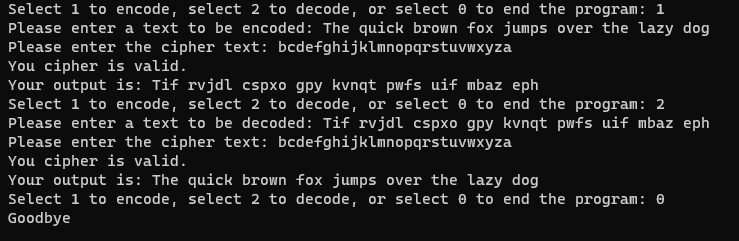

# string-encryption
A console (terminal-based) application that encrypts and decrypts user string based on a user provided cipher

# What I learned
* Converting a list into a string
* Use of 'dictionary' data type in Python
* Function docstring
* Manipulation of list using loops
* Mutability of strings and lists

# How the program runs
This is a very simple program that asks the user whether they'd like to encrypt or decrypt a String. An example of how this works is shown below.

